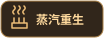
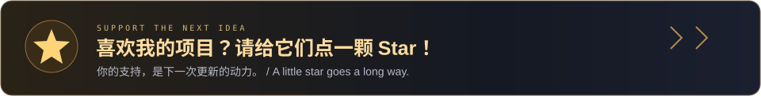
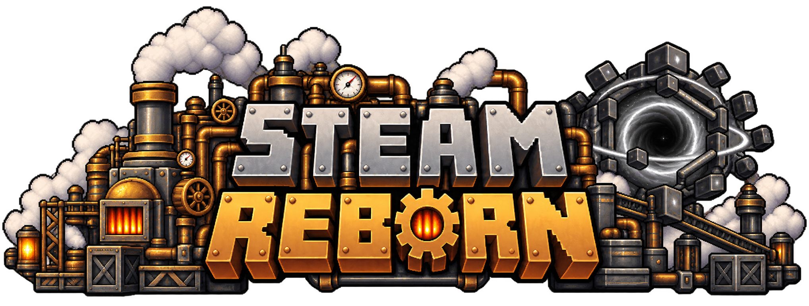

  

  <strong>🐾 为格雷世界，造点有趣的东西。</strong>

  
  
  

  

  
  &nbsp;
  
  &nbsp;
  

点击按钮进入仓库，再点右上角 <strong>☆ Star</strong>。

---

## GT-Simple-Wireless-Network

  

<strong>无线 EU · 实时监控 · 红石控制</strong>

  

  
  
  

---

## GT-Interesting-Thing

  

<strong>猫猫商店 · 趣味道具 · 探索与奖励</strong>

  

  
  
  

---

## GT-Steam-Reborn

  

<strong>蒸汽机器 · 奇点枢纽 · 跨维度物流</strong>

  

  
  
  

---

  <strong>⭐ 你的 Star，是下一次更新的动力。</strong>

非官方 GTNH 模组 · 版本与安装要求见各项目 Wiki / README

  

